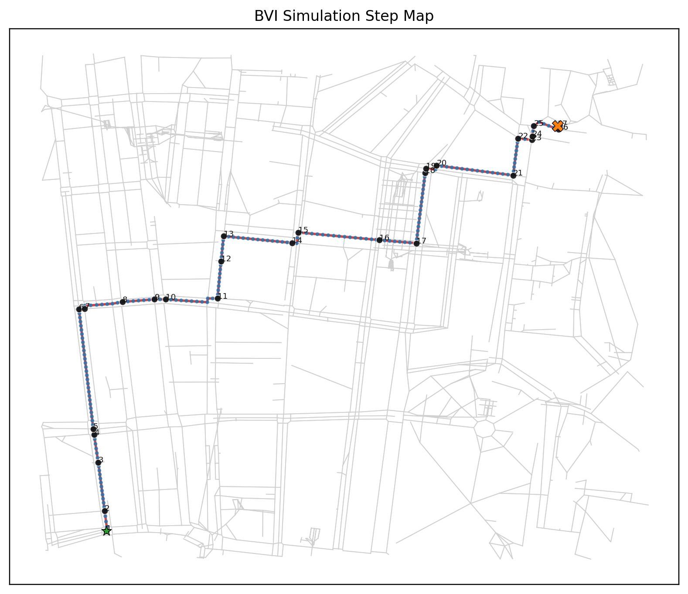
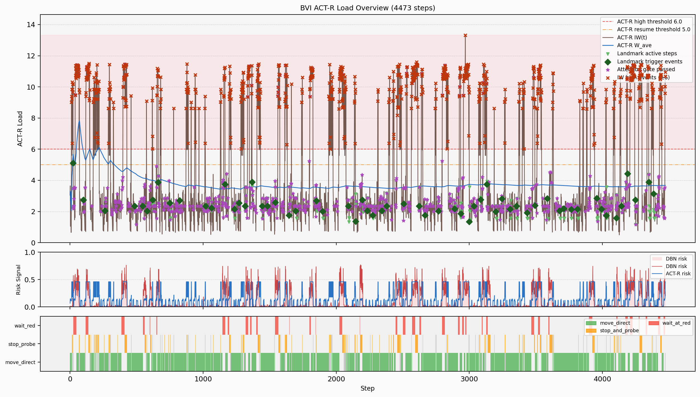

# BVI 态势感知模拟报告

**生成时间**: 2026-06-30 18:34:58

## 1. 模型配置

### 1.1 用户画像

| 参数 | 值 |
|------|-----|
| USER_ID | default |
| FAMILIARITY_LEVEL | 1.0 |
| EXPERTISE_PROXY | 0.8 |
| LANDMARK_EXPECTANCY_BONUS | 0.55 |
| SOUND_SOURCE_THRESHOLD | 0.4 |
| D | 0.5 |
| MAS | 1.5 |
| RT | -2.0 |
| ANS | 0.2 |

### 1.2 网络环境

- **起点**: 8588632
- **终点**: 13644962503
- **最大步数**: 15130

### 1.3 ACT-R 亚符号参数

| 参数 | 值 | 说明 |
|------|-----|------|
| MAS | 1.5 | 关联强度（spreading activation） |
| RT | -2.0 | 检索阈值 |
| ANS | 0.2 | 瞬时噪声 |

### 1.4 产生式优先级先验（本模型不做学习，单次出行内固定）

- 配置初始 utility 的产生式数: **57**
- 优先级由 (familiarity, expertise) 映射决定，越高越倾向 fire。

| 产生式 | 初始 Utility |
|--------|-------------|
| bk_overload_none_to_starting | 14.000 |
| bk_overload_starting_to_sustained | 14.000 |
| bk_overload_starting_to_none | 14.000 |
| bk_overload_sustained_to_none | 14.000 |
| bk_reference_short_to_present | 14.000 |
| bk_reference_long_to_present | 14.000 |
| bk_reference_present_to_absent_short | 14.000 |
| bk_reference_short_to_long | 14.000 |
| bk_safety_none_to_probing | 14.000 |
| bk_safety_probing_to_safe_long | 14.000 |
| bk_safety_probing_to_probing_under_threat | 14.000 |
| bk_safety_probing_to_none_after_move | 14.000 |
| bk_safety_safe_long_to_none_after_move | 14.000 |
| bk_sync_risk_low | 14.000 |
| bk_sync_risk_medium | 14.000 |
| bk_sync_risk_high_from_low | 14.000 |
| bk_sync_risk_high_from_medium | 14.000 |
| bk_sync_risk_low_from_high | 14.000 |
| bk_sync_risk_medium_from_high | 14.000 |
| crossing_red_wait | 12.000 |
## 2. 模拟结果概要

| 指标 | 值 |
|------|-----|
| 总步数 | 4473 |
| 是否到达目标 | 是 |
| DBN风险均值 | 0.1006 |
| ACT-R风险均值 | 0.1365 |
| 风险通道偏差MAE | 0.1152 |
| 注意门控通过次数 | 1076 / 4473 (24.1%) |
| 有参照支持的步数（地标+盲杖引导+盲道） | 2149 / 4473 (48.0%) |
| 其中：音频语义地标触发次数 | 61 |
| 其中：音频语义地标触发步数 | 435 / 4473 (9.7%) |
| 停止探测次数 | 548 |
| ACT-R 高瞬时负荷次数 | 928 |
## 3. 核心指标统计

| 指标 | 均值 | 标准差 | 最小值 | 最大值 |
|------|------|--------|--------|--------|
| ACT-R 瞬时负荷 IW | 3.9312 | 3.2761 | 0.4975 | 13.3118 |
| ACT-R 平均负荷 W_ave | 3.8231 | 0.6053 | 2.0510 | 7.8129 |
| 风险概率(DBN) | 0.1006 | 0.1705 | 0.0007 | 0.7704 |
| 风险信号(ACT-R) | 0.1365 | 0.1704 | 0.0000 | 0.4600 |
| 净优先级 | 0.2870 | 0.2540 | 0.0045 | 1.5000 |
| 突显度 | 0.3843 | 0.1688 | 0.0633 | 0.8333 |
| 声音强度 | 0.5789 | 0.2654 | 0.0501 | 1.0000 |

### 3.2 风险一致性（DBN通道 vs ACT-R决策通道）

| 指标 | DBN通道 | ACT-R决策通道 |
|------|---------|----------------|
| 均值 | 0.1006 | 0.1365 |
| 标准差 | 0.1705 | 0.1704 |
| 最小值 | 0.0007 | 0.0000 |
| 最大值 | 0.7704 | 0.4600 |
| 双通道偏差 MAE(|DBN-ACT-R|) | 0.1152 | 0.1152 |

### 3.3 模块级 A/E/持续时间/IW（均值）

| 模块 | A均值 | E均值 | 持续时间均值(ms) | IW均值 |
|------|------|------|-----------------|--------|
| 听觉 | 0.6631 | 1.1920 | 56.40 | 0.3661 |
| 触觉(感知) | 0.4565 | 1.2068 | 38.80 | 0.2439 |
| 执行(manual) | 0.8837 | 1.0036 | 82.10 | 0.1673 |
| 中央 | 0.1759 | 1.0036 | 16.00 | 0.6089 |
| 记忆 | 0.2330 | 2.0000 | 16.90 | 2.5450 |

## 4. 风险等级分布

### 4.1 DBN风险等级

| 等级 | 步数 | 占比 |
|------|------|------|
| low | 1362 | 30.4% |
| medium | 2943 | 65.8% |
| high | 168 | 3.8% |

### 4.2 ACT-R风险等级（决策通道）

| 等级 | 步数 | 占比 |
|------|------|------|
| low | 3583 | 80.1% |
| medium | 890 | 19.9% |
| high | 0 | 0.0% |

## 5. 决策动作分布

| 动作 | 步数 | 占比 |
|------|------|------|
| move_direct | 3405 | 76.1% |
| stop_and_probe | 548 | 12.3% |
| wait_at_red | 520 | 11.6% |

## 6. 仿真时间统计

| 指标 | 值 |
|------|-----|
| 总仿真时间 | 3623.013 s |
| 总步数 | 4473 |
| 每步平均时长 | 810.0 ms |

**各动作占用时间**

| 动作 | 步数 | 累计时间 (s) | 平均时长 (ms) | 占总时间比 |
|------|------|-------------|--------------|------------|
| move_direct | 3405 | 3178.627 | 933.5 | 87.7% |
| wait_at_red | 520 | 233.613 | 449.3 | 6.4% |
| stop_and_probe | 548 | 210.772 | 384.6 | 5.8% |

## 8. 环境 Schema 与地标触发率（熟悉度模型验证）

根据环境条件概率结构（env_schema.py）的预测，在不同环境下地标触发和错误负荷的分布。
验证假设：高熟悉度 × 高 P(landmark|environment) → 地标激活强 → 触发率高，错误负荷低

| 环境类型 | 总步数 | 地标触发次数 | 地标触发步数 | 步数占比 | 平均错误负荷 | 错误负荷标差 |
|---------|--------|----------|----------|---------|----------|----------|
| flat_road | 1166 | 13 | 119 | 10.2% | 1.3388 | 0.4735 |
| height_drop | 55 | 3 | 17 | 30.9% | 1.5091 | 0.5045 |
| intersection | 991 | 11 | 89 | 9.0% | 1.5146 | 0.5000 |
| slope_surface | 125 | 0 | 0 | 0.0% | 1.4720 | 0.5012 |
| tactile_guidance | 1730 | 28 | 180 | 10.4% | 1.2220 | 0.4157 |
| uneven_natural | 367 | 5 | 27 | 7.4% | 1.3787 | 0.4857 |

**解释**:
- **地标触发次数**: 新识别出一个地标事件的次数，适合与实测“几次认出地标”对齐
- **地标触发步数/步数占比**: 地标事件持续作为空间参照的步数，适合与实测“地标影响持续多久”对齐
- **错误负荷**: ACT-R 感知-运动通道的平均错误负荷指标（范围不限定在 [0,1]）
- **高熟悉度预期**: 熟悉度高的BVI在熟悉环境下触发率 ↑，错误负荷 ↓

## 9. 位置状态分布

位置状态由 `at_node`（是否在节点上）和 `crossing_active`（是否处于路口阶段）共同决定。

| 状态 | 说明 | 步数 | 占比 |
|------|------|------|------|
| 普通节点（路段端点，非路口） | `at_node=T, crossing=F` | 83 | 1.9% |
| 路口节点（等灯 / 开始穿越） | `at_node=T, crossing=T` | 548 | 12.3% |
| 边内推进中（路口穿越阶段） | `at_node=F, crossing=T` | 443 | 9.9% |
| 边内推进中（正常路段） | `at_node=F, crossing=F` | 3399 | 76.0% |

### 9.1 stop_and_probe 发生在哪些位置状态

| 状态 | stop_and_probe步数 | 占 stop_and_probe 比例 |
|------|-------------------|----------------------|
| 普通节点（路段端点，非路口） | 42 | 7.7% |
| 路口节点（等灯 / 开始穿越） | 231 | 42.2% |
| 边内推进中（路口穿越阶段） | 2 | 0.4% |
| 边内推进中（正常路段） | 273 | 49.8% |

```
    title stop_and_probe 发生位置状态分布
    "普通节点（路段端点，非路口）" : 42
    "路口节点（等灯 / 开始穿越）" : 231
    "边内推进中（路口穿越阶段）" : 2
    "边内推进中（正常路段）" : 273
```

### 9.2 哪个产生式（或外部门控）引发了 probe

| 触发来源 | stop_and_probe步数 | 占 stop_and_probe 比例 | 占总步数比例 |
|----------|-------------------|----------------------|--------------|
| cue_overload_sustained_probe | 188 | 34.3% | 4.2% |
| crossing_green_probe_when_reference_lost | 165 | 30.1% | 3.7% |
| commit_stop_and_probe | 99 | 18.1% | 2.2% |
| crossing_green_probe_when_overloaded | 81 | 14.8% | 1.8% |
| react_cane_obstacle_bottom_up | 12 | 2.2% | 0.3% |
| cue_just_entered_crossing_probe | 3 | 0.5% | 0.1% |

```
    title probe 触发来源分布
    "cue_overload_sustained_probe" : 188
    "crossing_green_probe_when_reference_lost" : 165
    "commit_stop_and_probe" : 99
    "crossing_green_probe_when_overloaded" : 81
    "react_cane_obstacle_bottom_up" : 12
    "cue_just_entered_crossing_probe" : 3
```


## 15. 路径底图与步序标注

- 地图文件: `sim_map_20260630_183458.png`



## 16. ACT-R 负荷图

- ACT-R 合并图: `sim_actr_dashboard_20260630_183458.png`



