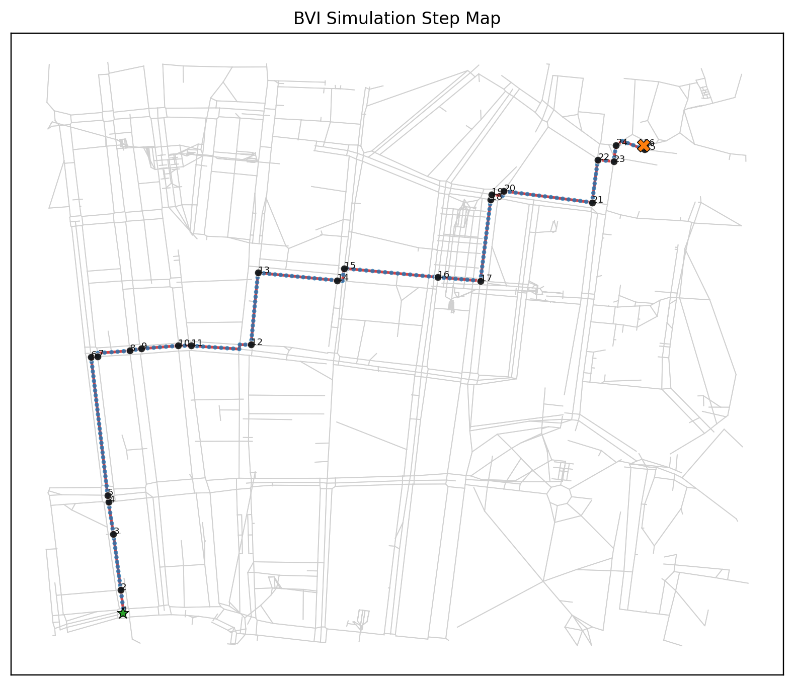
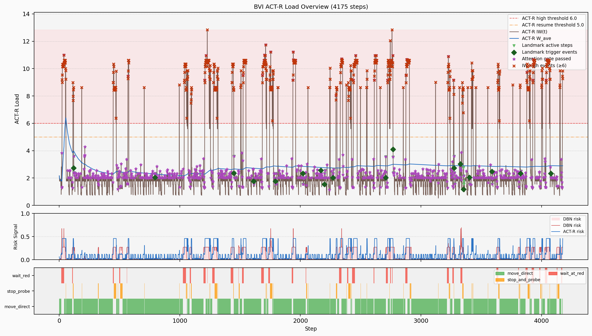

# BVI 态势感知模拟报告

**生成时间**: 2026-07-08 21:30:29

## 1. 模型配置

### 1.1 用户画像

| 参数 | 值 |
|------|-----|
| USER_ID | default |
| FAMILIARITY_LEVEL | 1 |
| EXPERTISE_PROXY | 0.8 |
| LANDMARK_EXPECTANCY_BONUS | 0.55 |
| SOUND_SOURCE_THRESHOLD | 0.4 |
| D | 0.5 |
| MAS | 1.5 |
| RT | -2.0 |
| ANS | 0.2 |

### 1.2 网络环境

- **起点**: 8588632
- **终点**: 13644962503
- **最大步数**: 15130

### 1.3 ACT-R 亚符号参数

| 参数 | 值 | 说明 |
|------|-----|------|
| MAS | 1.5 | 关联强度（spreading activation） |
| RT | -2.0 | 检索阈值 |
| ANS | 0.2 | 瞬时噪声 |

### 1.4 产生式优先级先验（本模型不做学习，单次出行内固定）

- 配置初始 utility 的产生式数: **55**
- 优先级由 (familiarity, expertise) 映射决定，越高越倾向 fire。

| 产生式 | 初始 Utility |
|--------|-------------|
| bk_overload_none_to_starting | 14.000 |
| bk_overload_starting_to_sustained | 14.000 |
| bk_overload_starting_to_none | 14.000 |
| bk_overload_sustained_to_none | 14.000 |
| bk_reference_short_to_present | 14.000 |
| bk_reference_long_to_present | 14.000 |
| bk_reference_present_to_absent_short | 14.000 |
| bk_reference_short_to_long | 14.000 |
| bk_safety_none_to_probing | 14.000 |
| bk_safety_probing_to_safe_long | 14.000 |
| bk_safety_probing_to_probing_under_threat | 14.000 |
| bk_safety_probing_to_none_after_move | 14.000 |
| bk_safety_safe_long_to_none_after_move | 14.000 |
| bk_sync_risk_low | 14.000 |
| bk_sync_risk_medium | 14.000 |
| bk_sync_risk_high_from_low | 14.000 |
| bk_sync_risk_high_from_medium | 14.000 |
| bk_sync_risk_low_from_high | 14.000 |
| bk_sync_risk_medium_from_high | 14.000 |
| crossing_red_wait | 12.000 |
## 2. 模拟结果概要

| 指标 | 值 |
|------|-----|
| 总步数 | 4175 |
| 是否到达目标 | 是 |
| DBN风险均值 | 0.0687 |
| ACT-R风险均值 | 0.1188 |
| 风险通道偏差MAE | 0.0871 |
| 注意门控通过次数 | 872 / 4175 (20.9%) |
| 有参照支持的步数（地标+盲杖引导+盲道） | 2273 / 4175 (54.4%) |
| 其中：音频语义地标触发次数 | 18 |
| 其中：音频语义地标触发步数 | 120 / 4175 (2.9%) |
| 停止探测次数 | 316 |
| ACT-R 高瞬时负荷次数 | 664 |
## 3. 核心指标统计

| 指标 | 均值 | 标准差 | 最小值 | 最大值 |
|------|------|--------|--------|--------|
| ACT-R 瞬时负荷 IW | 3.0452 | 2.9817 | 0.5302 | 12.8353 |
| ACT-R 平均负荷 W_ave | 2.7707 | 0.4102 | 1.7685 | 6.4030 |
| 风险概率(DBN) | 0.0687 | 0.1106 | 0.0008 | 0.6942 |
| 风险信号(ACT-R) | 0.1188 | 0.1513 | 0.0000 | 0.4600 |
| 净优先级 | 0.0613 | 0.0476 | 0.0029 | 1.0759 |
| 突显度 | 0.2380 | 0.0930 | 0.0452 | 0.6815 |
| 声音强度 | 0.3080 | 0.1566 | 0.0504 | 0.9980 |

### 3.2 风险一致性（DBN通道 vs ACT-R决策通道）

| 指标 | DBN通道 | ACT-R决策通道 |
|------|---------|----------------|
| 均值 | 0.0687 | 0.1188 |
| 标准差 | 0.1106 | 0.1513 |
| 最小值 | 0.0008 | 0.0000 |
| 最大值 | 0.6942 | 0.4600 |
| 双通道偏差 MAE(|DBN-ACT-R|) | 0.0871 | 0.0871 |

### 3.3 模块级 A/E/持续时间/IW（均值）

| 模块 | A均值 | E均值 | 持续时间均值(ms) | IW均值 |
|------|------|------|-----------------|--------|
| 听觉 | 0.2447 | 1.1959 | 33.00 | 0.1078 |
| 触觉(感知) | 0.3400 | 1.1907 | 45.70 | 0.1892 |
| 执行(manual) | 0.8913 | 1.0041 | 74.90 | 0.1837 |
| 中央 | 0.1447 | 1.0041 | 14.30 | 0.5451 |
| 记忆 | 0.1701 | 2.0000 | 11.90 | 2.0196 |

## 4. 风险等级分布

### 4.1 DBN风险等级

| 等级 | 步数 | 占比 |
|------|------|------|
| low | 1243 | 29.8% |
| medium | 2925 | 70.1% |
| high | 7 | 0.2% |

### 4.2 ACT-R风险等级（决策通道）

| 等级 | 步数 | 占比 |
|------|------|------|
| low | 3534 | 84.6% |
| medium | 641 | 15.4% |
| high | 0 | 0.0% |

## 5. 决策动作分布

| 动作 | 步数 | 占比 |
|------|------|------|
| move_direct | 3405 | 81.6% |
| wait_at_red | 454 | 10.9% |
| stop_and_probe | 316 | 7.6% |

## 6. 仿真时间统计

| 指标 | 值 |
|------|-----|
| 总仿真时间 | 3448.013 s |
| 总步数 | 4175 |
| 每步平均时长 | 825.9 ms |

**各动作占用时间**

| 动作 | 步数 | 累计时间 (s) | 平均时长 (ms) | 占总时间比 |
|------|------|-------------|--------------|------------|
| move_direct | 3405 | 3116.002 | 915.1 | 90.4% |
| wait_at_red | 454 | 202.464 | 446.0 | 5.9% |
| stop_and_probe | 316 | 129.546 | 410.0 | 3.8% |

## 8. 环境 Schema 与地标触发率（熟悉度模型验证）

根据环境条件概率结构（env_schema.py）的预测，在不同环境下地标触发和错误负荷的分布。
验证假设：高熟悉度 × 高 P(landmark|environment) → 地标激活强 → 触发率高，错误负荷低

| 环境类型 | 总步数 | 地标触发次数 | 地标触发步数 | 步数占比 | 平均错误负荷 | 错误负荷标差 |
|---------|--------|----------|----------|---------|----------|----------|
| flat_road | 1198 | 4 | 36 | 3.0% | 1.3297 | 0.4703 |
| height_drop | 41 | 0 | 0 | 0.0% | 1.3171 | 0.4711 |
| intersection | 902 | 5 | 33 | 3.7% | 1.5499 | 0.4978 |
| slope_surface | 21 | 2 | 11 | 52.4% | 1.4762 | 0.5118 |
| tactile_guidance | 1971 | 7 | 38 | 1.9% | 1.2374 | 0.4256 |
| uneven_natural | 3 | 0 | 0 | 0.0% | 1.3333 | 0.5774 |

**解释**:
- **地标触发次数**: 新识别出一个地标事件的次数，适合与实测“几次认出地标”对齐
- **地标触发步数/步数占比**: 地标事件持续作为空间参照的步数，适合与实测“地标影响持续多久”对齐
- **错误负荷**: ACT-R 感知-运动通道的平均错误负荷指标（范围不限定在 [0,1]）
- **高熟悉度预期**: 熟悉度高的BVI在熟悉环境下触发率 ↑，错误负荷 ↓

## 9. 位置状态分布

位置状态由 `at_node`（是否在节点上）和 `crossing_active`（是否处于路口阶段）共同决定。

| 状态 | 说明 | 步数 | 占比 |
|------|------|------|------|
| 普通节点（路段端点，非路口） | `at_node=T, crossing=F` | 81 | 1.9% |
| 路口节点（等灯 / 开始穿越） | `at_node=T, crossing=T` | 430 | 10.3% |
| 边内推进中（路口穿越阶段） | `at_node=F, crossing=T` | 472 | 11.3% |
| 边内推进中（正常路段） | `at_node=F, crossing=F` | 3192 | 76.5% |

### 9.1 stop_and_probe 发生在哪些位置状态

| 状态 | stop_and_probe步数 | 占 stop_and_probe 比例 |
|------|-------------------|----------------------|
| 普通节点（路段端点，非路口） | 40 | 12.7% |
| 路口节点（等灯 / 开始穿越） | 199 | 63.0% |
| 边内推进中（路口穿越阶段） | 0 | 0.0% |
| 边内推进中（正常路段） | 77 | 24.4% |

```
    title stop_and_probe 发生位置状态分布
    "普通节点（路段端点，非路口）" : 40
    "路口节点（等灯 / 开始穿越）" : 199
    "边内推进中（路口穿越阶段）" : 0
    "边内推进中（正常路段）" : 77
```

### 9.2 哪个产生式（或外部门控）引发了 probe

| 触发来源 | stop_and_probe步数 | 占 stop_and_probe 比例 | 占总步数比例 |
|----------|-------------------|----------------------|--------------|
| crossing_green_probe_when_reference_lost | 144 | 45.6% | 3.4% |
| crossing_green_probe_when_overloaded | 69 | 21.8% | 1.7% |
| cue_overload_sustained_probe | 55 | 17.4% | 1.3% |
| commit_stop_and_probe | 43 | 13.6% | 1.0% |
| cue_just_entered_crossing_probe | 5 | 1.6% | 0.1% |

```
    title probe 触发来源分布
    "crossing_green_probe_when_reference_lost" : 144
    "crossing_green_probe_when_overloaded" : 69
    "cue_overload_sustained_probe" : 55
    "commit_stop_and_probe" : 43
    "cue_just_entered_crossing_probe" : 5
```


## 15. 路径底图与步序标注

- 地图文件: `sim_map_20260708_213028.png`



## 16. ACT-R 负荷图

- ACT-R 合并图: `sim_actr_dashboard_20260708_213028.png`



